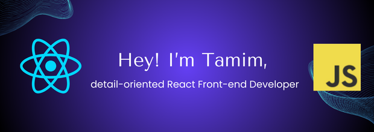

I'm a passionate and detail-oriented React Front-end Developer with a strong foundation in HTML, CSS, and a knack for creating responsive and visually appealing user interfaces. Here's a glimpse of my tech stack:

## 🔧 Tech Stack

- **Languages:** HTML, CSS, JavaScript
- **Frameworks:** React, Express.js
- **CSS Framework:** Tailwind CSS
- **Database:** MongoDB
- **Version Control:** Git, GitHub
- **Server-Side:** Node.js

## 🚀 What I'm currently working on

I'm currently working on **Bhraman Guide**, a full-stack tour guide application revolutionizing the online tour guide and provide tour services. From seamless user authentication to a dashboard management system, this project incorporates the latest technologies to deliver a cutting-edge platform. Stay tuned for updates!

## 🌱 What I'm currently learning

I'm currently diving deeper into **Next.JS**, exploring advanced concepts and best practices.

## What

## 📫 Let's connect

[ LinkedIn](https://www.linkedin.com/in/tamim-talukdar-35a5a2287/)
[ Twitter](https://twitter.com/your-handle)
[ Portfolio](https://www.yourportfolio.com)

## 🤝 Open to collaborations

I'm open to collaborating on exciting projects! If you have something in mind, feel free to reach out by **[Email](s163.tamim@gmail.com).**

## 💡 Fun Fact

I enjoy experimenting with new coding challenges and turning them into creative solutions.
